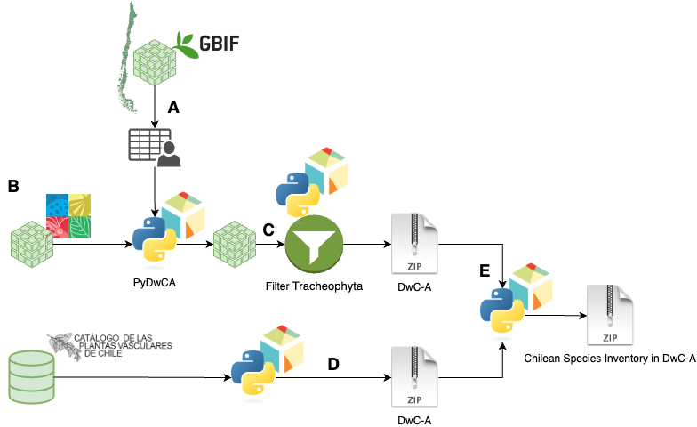

# PyDwCA Examples

Usage examples of the [PyDwCA library](https://github.com/IEB-BIODATA/pydwca).

## National Biodiversity Inventory Pipeline

As [presented](https://doi.org/10.3897/biss.8.137799) in the [2024 SPNHC & TDWG Joint Conference](https://www.tdwg.org/conferences/2024/), this pipeline was develop to generate a chilean biodiversity inventory of species taking information from the [Catalogue of Life](https://www.catalogueoflife.org/) and the [Catalogue of Vascular Plant of Chile](https://www.herbariodigital.cl/). Potentially, other specialized curated sources can be added.

### [GBIF Chile Species](GBIF%20Chile%20Species.ipynb)

**A)** Acquisition of the species presented in Chilean territory using the GBIF data platform.

### [Catalogue of Life](Catalogue%20of%20Life.ipynb)

**B)** Download the DwC-A of the Catalogue of Life, filtering the species using the list obtained by GBIF and the PyDwCA library.

**C)** Exclusion of species of Tracheophyta using the package.

### [Catalogue of Vascular Plants of Chile](Catalogue%20of%20Vascular%20Plants%20of%20Chile.ipynb)

**D)** Generation of the DwC-A of the Catalogue of Vascular Plants of Chile using the Python library presented. This contains a curated list of the species of Tracheophyta in Chile.

### [Merging Catalogues](Merging%20Catalogues.ipynb)

**E)** Merging of both DwC-A to get the first version of the Chilean National Biodiversity Inventory.

## [Lazy Ingestion of Chilean GBIF occurrences]()
Using [PyDwCA library](https://github.com/IEB-BIODATA/pydwca) and [Polars](https://pola.rs/) Lazy Frame, we ingest the chilean occurrences of species reported in GBIF to a local database. This process is presented as an example of managing large files without locating them in memory. 
